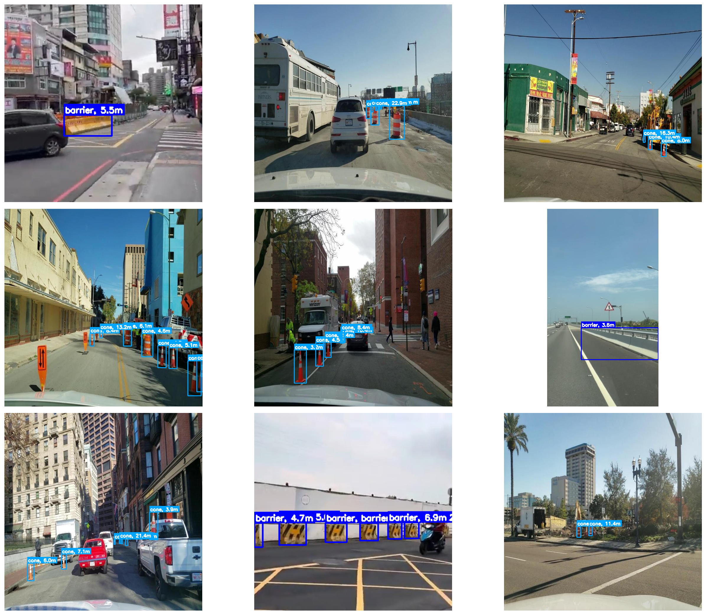

# Cone, Barrier & Stop-Sign Detection for Navigation

A computer-vision pipeline developed as part of a two-day technical assessment for **ERIC Robotics**, received on **21 September 2026**.

The objective was to build a perception pipeline for an AMR that can:

* Detect `cone`, `barrier`, and `stop_sign`
* Estimate the distance of detected objects from the camera
* Investigate ways of making the inference pipeline suitable for edge hardware

I enjoyed working on this because it was not just a matter of training a detector and reporting a metric. The interesting part was understanding why the data was behaving the way it was, identifying where the model was failing, and then connecting detection with geometry and eventually edge deployment.

---

## Starting with the Dataset

The first step was finding data that actually matched the problem.

BDD100K was considered initially, but its detection classes and predominantly urban-driving context did not provide the required combination of construction/navigation objects. Since the target environment is closer to construction and facility navigation, I looked for datasets containing roadwork objects instead.

The primary dataset selected was **`roadwork_VPanels_all_objects`**, which contains roadwork and construction scenes.

The original classes were reduced to the objects relevant to the navigation problem:

```text
Cone            → cone
Tubular Marker  → cone
Drum            → cone
Barrier         → barrier

Vertical Panels → discarded
```

Tubular markers and drums were grouped with cones because, for this particular navigation problem, they serve the same practical purpose of representing a physical obstacle/marker.

The dataset initially contained only a training split, so it was divided into train/validation/test sets.

---

## The First Problem: Barriers

The first dataset immediately showed a major imbalance:

```text
Cone       → 26,011 annotations
Barrier    →    495 annotations
```

There were only **129 images containing barriers**, and the available barriers were visually similar.

Rather than allowing the model to simply learn the dominant cone class, barrier samples were oversampled with augmentation. This produced the first three-class dataset after stop-sign annotations were added.

The initial training dataset contained:

```text
Train → 5,123 images
Val   →   479 images
Test  →   480 images
```

---

## Stop Signs Without Collecting Another Dataset

Stop signs were a different problem.

The selected roadwork dataset did not provide enough stop-sign annotations. However, the chosen detector was **YOLOv8s pretrained on COCO**, and COCO already contains a `stop_sign` class.

That meant stop signs did not need to be treated as an entirely unknown object.

The COCO-pretrained model was run over the available images, and detections belonging to COCO class `11` with confidence ≥ 0.5 were converted into training annotations.

This resulted in the final target ontology:

```text
0 → barrier
1 → cone
2 → stop_sign
```

This was used as a practical form of pseudo-labeling to prevent visible stop signs from simply being treated as background.

---

# Training the Detector

YOLOv8s was selected as the starting point because it provided a useful balance between model capacity and eventual edge deployment. More importantly, its COCO pretraining already contains knowledge of stop signs and traffic cones, giving the training process a useful starting representation.

Three training stages were used.

### v1 — Initial Training

The first model was trained on the initial combined dataset.

| Class       |     mAP50 | Recall |
| ----------- | --------: | -----: |
| Barrier     |     0.514 |  0.373 |
| Cone        |     0.729 |  0.688 |
| Stop Sign   |     0.948 |  0.910 |
| **Overall** | **0.730** |      — |

The results immediately showed that the main weakness was **barrier recall**.

The confusion matrix was particularly useful here: barriers were frequently being treated as background rather than being consistently detected.

At this point, the problem did not appear to be primarily a cone or stop-sign detection problem. It was a data-representation problem for barriers.

---

## Adding More Barrier Diversity

To address this, a second dataset, **`vulture-40`**, was introduced specifically for barriers.

This dataset contains visually different barriers, including:

* Concrete barriers
* Yellow/black barriers

Its segmentation annotations were converted into bounding boxes, with the relevant barrier variants mapped into the existing `barrier` class. Fence annotations were excluded.

This added visual diversity rather than simply producing more copies of the same type of red/white roadwork barrier.

### A Fine-Tuning Issue

The first attempt was to fine-tune the existing model directly on the barrier-only dataset.

That introduced an important issue: the barrier dataset had only one class, so the YOLO detection head was configured for a single class. Fine-tuning this way effectively removed the original three-class detection setup.

The approach was therefore changed.

Instead of training a barrier-only model, the additional barrier data was merged back into the original three-class dataset and the detector was trained with all three target classes.

---

# v2 — Merged Barrier Dataset

The second training stage used the additional barrier data while retaining the original cone and stop-sign data.

| Class       |     mAP50 | Recall |
| ----------- | --------: | -----: |
| Barrier     |     0.688 |  0.623 |
| Cone        |     0.723 |  0.677 |
| Stop Sign   |     0.922 |  0.907 |
| **Overall** | **0.777** |      — |

The change in barrier recall was:

```text
v1 → 0.373
v2 → 0.623
```

This supported the original observation from the confusion matrix: adding more diverse barrier examples was addressing the actual weakness in the dataset.

---

# v3 — Final Training

After the v2 experiment, the complete merged dataset was used for a fresh training run from the YOLOv8s pretrained weights.

The final dataset contained:

```text
                 Train    Val    Test
Images           5544     600    541

Barrier          6294     310    175
Cone             34541    3165   3357
Stop Sign        285      23     22
```

The resulting metrics were:

| Class       |     mAP50 | Recall |
| ----------- | --------: | -----: |
| Barrier     |     0.791 |  0.735 |
| Cone        |     0.730 |  0.640 |
| Stop Sign   |     0.912 |  0.870 |
| **Overall** | **0.811** |      — |

The progression of barrier recall was:

```text
v1 → 0.373
v2 → 0.623
v3 → 0.735
```

The confusion matrices and validation results were used alongside mAP50 rather than relying on a single metric. In particular, they helped identify that the main limitation in the initial model was the representation of barriers rather than a general failure of the detector.

At this point, within the available two-day window, I moved on from further dataset tuning to the next part of the assignment.

---

# From Detection to Distance

The next question was: once an object is detected, how can its distance be estimated from a normal camera image?

I deliberately looked into this part because it was the aspect I found most interesting from a practical computer-vision perspective.

The implemented approach uses **monocular distance estimation with the pinhole-camera model**, using the apparent height of the detected object.

The focal length was estimated from the image width and assumed horizontal FOV:

```text
f = (W / 2) / tan(FOV / 2)
```

and object distance was estimated using:

```text
D = (H × f) / h
```

where:

```text
D → estimated camera-to-object distance
H → assumed real-world object height
f → focal length in pixels
h → detected bounding-box height
```

The implementation uses representative object heights for the three classes and constrains the resulting estimate to a practical range of **0.5 m to 50 m**.

This was chosen because it provides a lightweight geometry-based solution from a single RGB camera without requiring stereo cameras, a depth sensor, or an additional neural depth-estimation model.

It is also important to state what this does **not** provide: the result is an approximate camera-to-object distance, not a calibrated 3D range measurement. Accuracy depends on the assumed object dimensions, camera FOV, perspective, and bounding-box localization.

The resulting detections are annotated directly in the requested form:

```text
label, distance in m
```



I also spent time looking into alternatives such as learned monocular depth and other geometric approaches. For the assignment timeframe, the pinhole model provided a direct way to connect the detector output with physical distance while keeping the pipeline lightweight.

---

# Edge Optimization

The final part of the assignment was to investigate how the detector could be made more suitable for limited hardware.

The optimization notebook explores the inference side of the pipeline, including model/precision changes intended to reduce computational cost.

This part was more constrained by the available environment than the earlier stages. Most of the work was being performed through Kaggle, and repeated GPU/runtime issues consumed a significant portion of the available time.

Because of those environment limitations, I was **not able to obtain a reliable CPU/GPU inference benchmark within this submission window**. I therefore have not included fabricated FPS numbers or presented an unverified edge benchmark as a completed result.

This is also why the edge section should be interpreted as an investigation of the deployment path rather than as a completed hardware benchmark.

I have previously worked with actual NVIDIA Jetson hardware for model optimization and inference benchmarking, where measuring TensorRT/FP16 performance was considerably more direct. In this assessment, however, the available Kaggle environment did not provide the same controlled edge-device setup.

---

# Overall Pipeline

The work therefore progressed as:

```text
Dataset search
      ↓
Construction-focused dataset selection
      ↓
Class remapping
      ↓
Barrier imbalance identified
      ↓
Barrier augmentation
      ↓
COCO-based stop-sign pseudo-labeling
      ↓
YOLOv8s v1
      ↓
Confusion matrix → barrier recall identified as bottleneck
      ↓
Additional barrier dataset
      ↓
Three-class merged training
      ↓
YOLOv8s v2
      ↓
Further improvement
      ↓
YOLOv8s v3
      ↓
Monocular geometric distance estimation
      ↓
Edge optimization investigation
```

The final detector reached **0.811 mAP50** on the reported evaluation, with barrier mAP50 improving from **0.514 in v1 to 0.791 in v3**.

More importantly, the progression gave a practical view of the full problem: the quality of the detector depended heavily on how the dataset represented the difficult class, distance estimation required assumptions when only a monocular image was available, and deployment constraints could be as significant as model accuracy when moving toward robotics hardware.

---

## Repository Contents

```text
.
├── navigation-detection-training.ipynb
├── eric-inference-distance.ipynb
├── edge-optimization.ipynb
└── README.md
```

The notebooks separate the three main stages of the assignment:

```text
navigation-detection-training.ipynb
    → dataset preparation and detector training

eric-inference-distance.ipynb
    → detection inference and monocular distance estimation

edge-optimization.ipynb
    → inference optimization and edge-deployment investigation
```

## Closing Note

This project was completed within the two-day assessment window provided by **ERIC Robotics**.

The implementation represents what I was able to investigate and validate within the assessment timeframe, with the notebooks retaining the actual experiments and intermediate results rather than hiding the failed approaches that helped shape the final pipeline.
